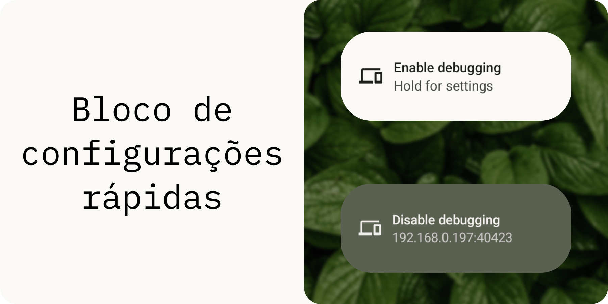
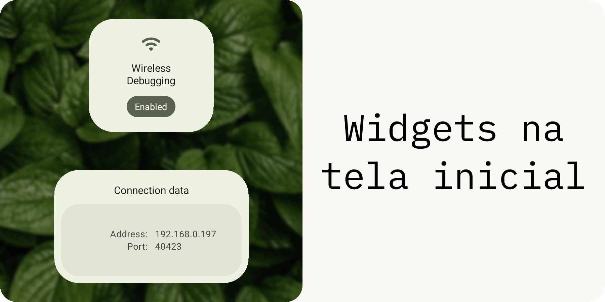
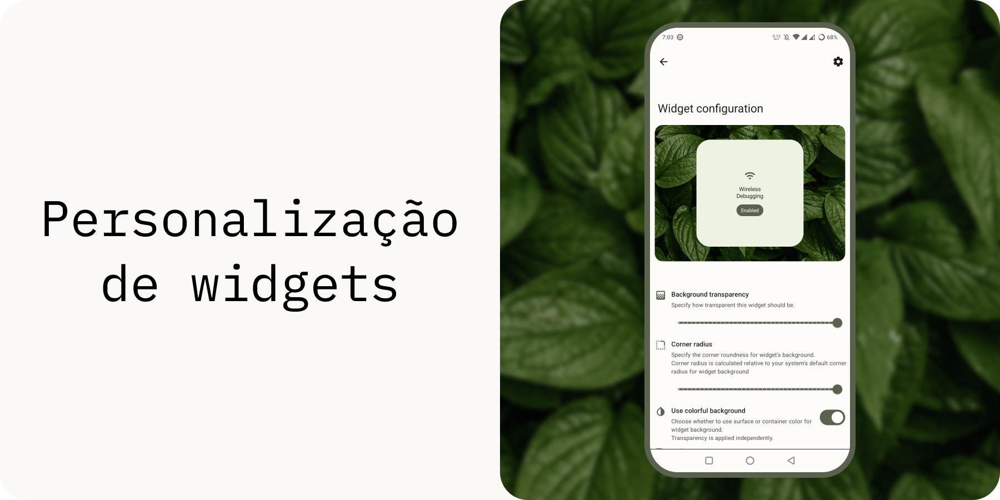
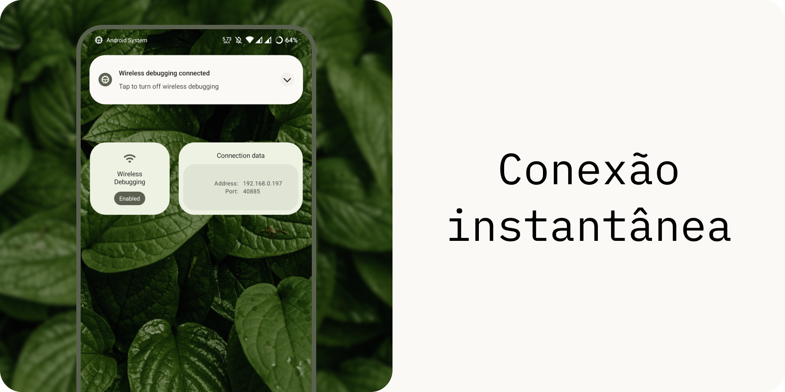
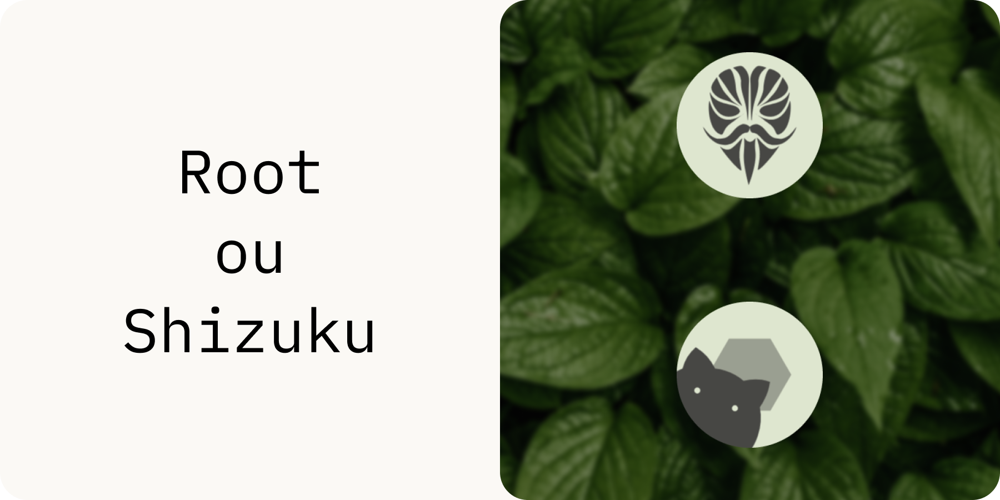
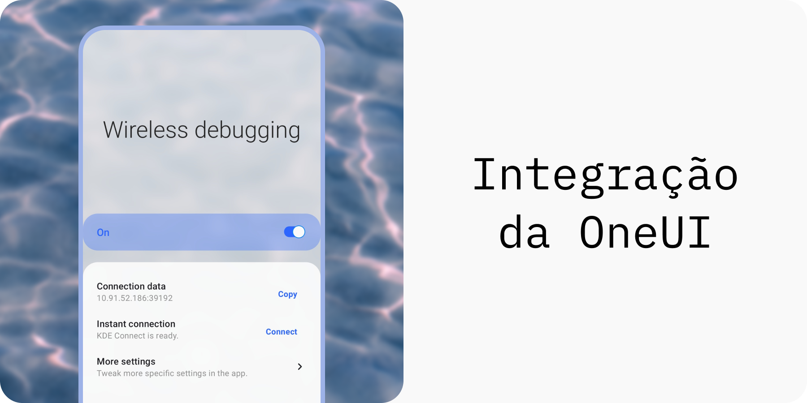

    
    

> Leia em outros idiomas: [`🇺🇸`](./readme.md) [`🇷🇺`](./readme.ru.md) [`🇨🇳`](./readme.zh_cn.md) [`Traduza para o seu idioma!`](./translate.md)

**WADBS** (abreviação de **Wireless Android Debugging Bridge Switch**) é um app que permite ativar e desativar o recurso Depuração por Wi-Fi do Android rapidamente.
Ele fornece vários widgets e um bloco de configurações rápidas para fazer isso. 
Você também pode conectar-se instantaneamente ao seu PC usando o recurso de compartilhamento da área de transferência do KDE Connect (veja [scripts](./scripts/readme.pt_br.md)).

> **Origem do Projeto**: Este projeto é baseado em [Smooth-E/wireless-adb-switch](https://github.com/Smooth-E/wireless-adb-switch)
> 
> **Versão do Android**: Suporta Android 7.0 e superior (API 24+)

## Recursos

## Créditos

[libsu](https://github.com/topjohnwu/libsu) - uma biblioteca que facilita a execução de operações que exigem root.
 [Shizuku](https://shizuku.rikka.app/) - uma estrutura que o WADBS pode usar como alternativa ao acesso root.
 [IBM Plex Mono](https://fonts.google.com/specimen/IBM+Plex+Mono) - fonte usada em meus designs para este app.
 [HarmonyOS Sans](https://developer.huawei.com/consumer/cn/design/resource-V1/) – fonte usada para imagens promocionais em Chinês Simplificado.
 [Leaves](https://unsplash.com/photos/wAU3MfsGPNw) - uma foto incrível de folhas que usei como fundo para meus designs foi feita por [Aedrian](https://unsplash.com/@aedrian).
 [Waves](https://unsplash.com/photos/a-close-up-of-a-body-of-water-with-ripples-dujWQFlKE7c) - uma foto incrível de ondas que usei para a imagem promocional da integração da OneUI foi feita por [Michał Bińkiewicz](https://unsplash.com/@binkievitz).

## Licença

WADBS é um software livre. Foi feito com o intuito de facilitar a vida dos desenvolvedores.
Ele está licenciado sob a GNU General Public License versão 3. 
Resumindo - você pode redistribuí-lo e modificá-lo, mas deve dar crédito ao autor original.

WADBS é distribuído "como está". 
Os desenvolvedores deste app não se responsabilizam por qualquer tipo de dano ou prejuízo causado pelo conteúdo deste repositório ou materiais relacionados a ele diretamente ou não.
